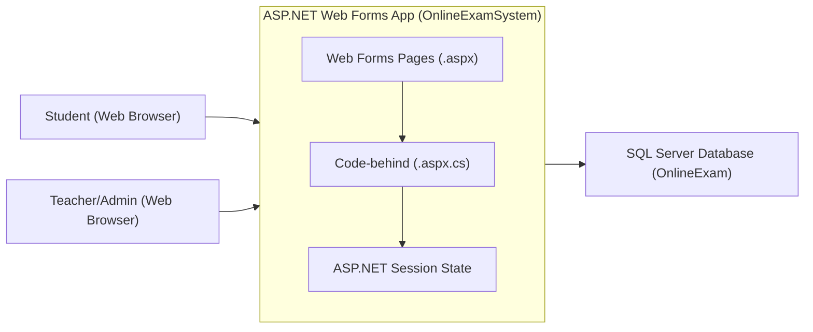
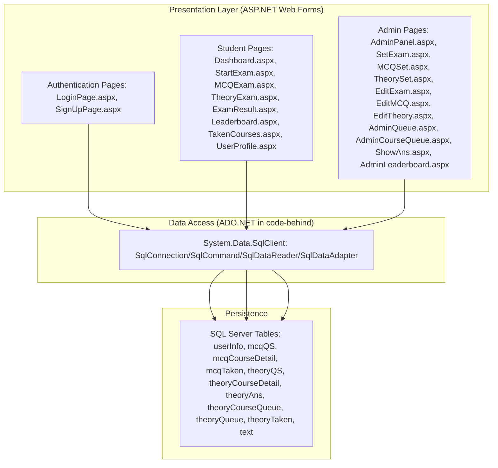
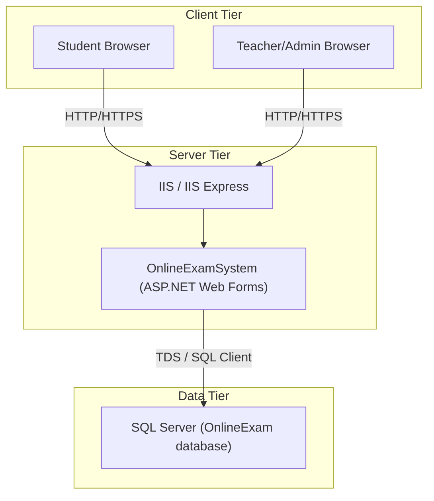
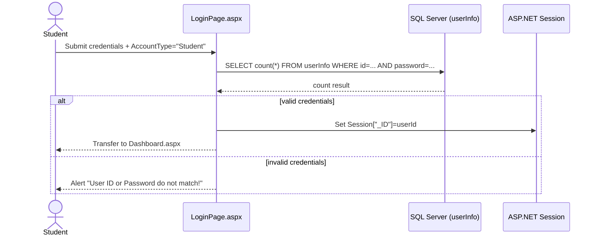
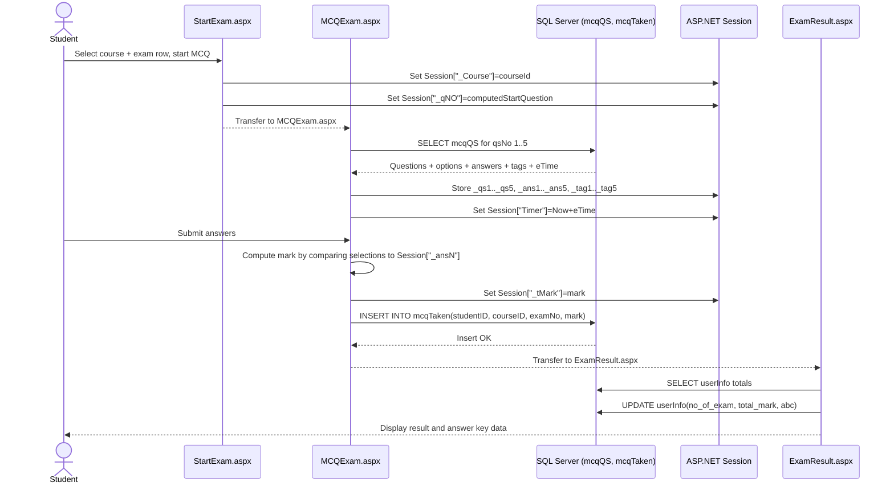
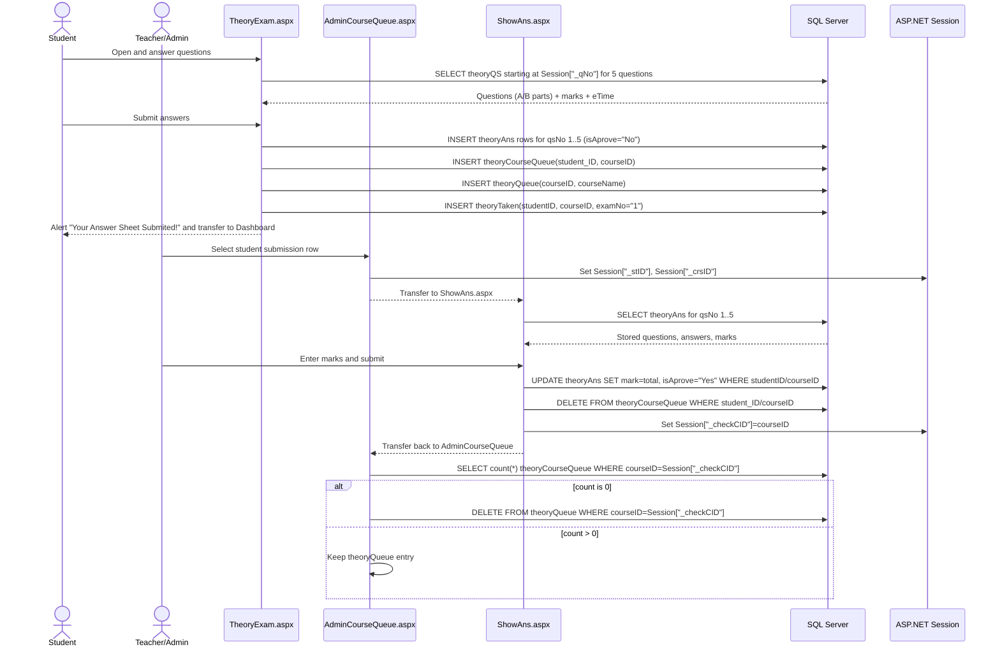

# Online Examination System (ASP.NET Web Forms) — Enterprise Documentation

## Document control

This document provides a consolidated, production-oriented technical and business description of the “Online Examination System” ASP.NET Web Forms application contained in this repository. It is designed for enterprise onboarding, audits, and ongoing maintenance.

### Scope

This documentation covers:

1. Business purpose and key capabilities.
2. Installation, setup, configuration, and how to run the application.
3. Project structure and major files.
4. Interfaces and user interactions (Web UI) and key flows.
5. Architecture diagrams (system, component, data flow, deployment) derived from the codebase.
6. Sequence diagrams for core flows (authentication, MCQ exam attempt, theory exam + evaluation).
7. Class/function documentation for the major page classes and their event handlers.
8. Contribution and extension guidance, including code quality and security notes derived from current implementation.

### Source-of-truth statement

All statements and diagrams in this document are derived from the repository’s code and configuration as currently present, especially:

- `Online-Examination-System-7903/OnlineExamSystem/*.aspx` and `*.aspx.cs` code-behind files
- `Online-Examination-System-7903/OnlineExamSystem/Web.config`
- `Online-Examination-System-7903/database-script/Online-Examination-System-Databse-Script.sql`
- `Online-Examination-System-7903/OnlineExamSystem/OnlineExamSystem.csproj`

Where the code uses placeholder values or incomplete features, this is explicitly stated.

## Tool overview and business purpose

The Online Examination System is a monolithic ASP.NET Web Forms web application that enables:

- Students to register, authenticate, select available course exams, attempt MCQ or Theory exams, and view results and leaderboards.
- Teachers (implemented as a single hardcoded “Admin” account) to create exams, manage question banks, and evaluate submitted theory answer sheets.

The system’s primary business value is to digitize common examination workflows and reduce paper-based administration by enabling online question delivery, submission, scoring (for MCQ), and teacher evaluation (for theory).

## Key features and capabilities

### Student capabilities

Students interact through Web Forms pages including `LoginPage.aspx`, `SignUpPage.aspx`, `Dashboard.aspx`, `StartExam.aspx`, `MCQExam.aspx`, `TheoryExam.aspx`, `ExamResult.aspx`, `Leaderboard.aspx`, `TakenCourses.aspx`, and `UserProfile.aspx`.

Student functionality implemented in code includes:

- Account registration with profile image upload (`SignUpPage.aspx.cs`).
- Student login using database-backed credential check (`LoginPage.aspx.cs`).
- Dashboard navigation to profile, leaderboard, and exam selection (`Dashboard.aspx.cs`).
- Course selection driven by the “semester” field from the `userInfo` table (`StartExam.aspx.cs`).
- Prevention of retaking a specific exam number for a course (`StartExam.aspx.cs` checks `mcqTaken`/`theoryTaken`).
- MCQ exam attempt, scoring, persistence of score in `mcqTaken`, and result display (`MCQExam.aspx.cs`, `ExamResult.aspx.cs`).
- Leaderboard behavior based on the user’s semester stored into session (`Leaderboard.aspx.cs`).

### Teacher/admin capabilities

Admin pages include `AdminPanel.aspx`, `SetExam.aspx`, `MCQSet.aspx`, `TheorySet.aspx`, `EditExam.aspx`, `EditMCQ.aspx`, `EditTheory.aspx`, `AdminQueue.aspx`, `AdminCourseQueue.aspx`, `ShowAns.aspx`, and `AdminLeaderboard.aspx`.

Admin functionality implemented in code includes:

- Admin login as a hardcoded credential pair (`Admin`/`Admin`) in `LoginPage.aspx.cs`.
- Exam creation and question insertion for MCQ (`MCQSet.aspx.cs` inserts into `mcqQS` and registers exams in `mcqCourseDetail`).
- Exam creation and question insertion for Theory (`TheorySet.aspx.cs` inserts into `theoryQS` and registers exams in `theoryCourseDetail`).
- “Queue” workflow for theory answer evaluation:
  - Students submit theory answers to `theoryAns` and enqueue themselves into `theoryCourseQueue` and `theoryQueue` (`TheoryExam.aspx.cs`).
  - Admin selects a student/course from a grid and opens the answer sheet (`AdminCourseQueue.aspx.cs` → `ShowAns.aspx.cs`).
  - Admin submits marks, updates `theoryAns`, removes the student from `theoryCourseQueue`, and if the course queue becomes empty removes the course row from `theoryQueue` (`ShowAns.aspx.cs`, `AdminCourseQueue.aspx.cs`).

### Known functional limitations (from repository)

The repository README explicitly states limitations:

- Only five questions per exam are supported.
- The timer has “some problem”.

These limitations align with the code: `MCQExam.aspx.cs` and `TheoryExam.aspx.cs` both render and submit exactly five questions, and the timer logic relies on `Session["Timer"]`.

## Supported platforms, languages, and versions

### Application stack

- ASP.NET Web Forms (C#)
- Target framework: .NET Framework 4.8 (`OnlineExamSystem.csproj`, `Web.config`)
- Database: SQL Server (code uses `System.Data.SqlClient`)
- Frontend UI: server-rendered Web Forms + Bootstrap CSS (`CSS/bootstrap.css`)

### Supported runtime hosts

The project is intended to be hosted on:

- IIS with ASP.NET 4.x enabled, or
- Visual Studio / IIS Express (project config enables IIS Express in `.csproj`)

The `.csproj` contains:
- `<UseIISExpress>true</UseIISExpress>`
- Development server URL `http://localhost:55618/` in project extensions.

## Installation prerequisites and steps

### Prerequisites

1. Windows environment with IIS (or IIS Express via Visual Studio) because this is a .NET Framework 4.8 Web Forms application.
2. Visual Studio capable of building .NET Framework 4.8 web projects (e.g., Visual Studio 2019/2022 with appropriate workloads).
3. SQL Server instance (local or remote) with network access from the web server.
4. NuGet package restore capability (the repo includes a `packages/` folder and a `packages.config`).

### Restore/build steps (developer workstation)

1. Open solution: `Online-Examination-System-7903/OnlineExamSystem.sln`.
2. Restore packages for the `OnlineExamSystem` project. The project references:
   - `Microsoft.CodeDom.Providers.DotNetCompilerPlatform` v1.0.0
   - `Microsoft.Net.Compilers` v1.0.0
   (`OnlineExamSystem/packages.config` and the `.csproj` imports under `..\packages\...`).
3. Build the solution targeting .NET Framework 4.8.
4. Configure the database (see database section) and update the application’s connection string usage (see configuration).

### Database setup steps

1. Create a database (the SQL script indicates database name `OnlineExam`).
2. Execute:
   - `Online-Examination-System-7903/database-script/Online-Examination-System-Databse-Script.sql`

Important: the SQL file in this repository is stored in a base64-encoded representation in the workspace extraction. The source file is authoritative and should be executed as provided in the repository (it contains `CREATE DATABASE [OnlineExam]` and table definitions such as `userInfo`, `mcqQS`, `mcqTaken`, `theoryQS`, `theoryAns`, and queue tables).

## Setup and configuration instructions

### Configuration files

The primary runtime configuration is:

- `Online-Examination-System-7903/OnlineExamSystem/Web.config`

Key excerpts (as implemented):

- Compilation targets .NET Framework 4.8:
  - `<compilation debug="true" targetFramework="4.8" />`
- `httpRuntime` targetFramework is set to 4.5.2 even though compilation is 4.8:
  - `<httpRuntime targetFramework="4.5.2" />`
- Connection strings exist but are placeholders:
  - `dbconnection` and `OnlineExamConnectionString` both use `your-database-connection-string`.

### Connection string usage in code

Most code-behind files do not read `Web.config` connection strings. Instead, they hardcode:

```csharp
string CS = "your-database-connection-string";
```

This pattern appears in:

- `LoginPage.aspx.cs`
- `SignUpPage.aspx.cs`
- `StartExam.aspx.cs`
- `MCQExam.aspx.cs`
- `TheoryExam.aspx.cs`
- `ExamResult.aspx.cs`
- `Leaderboard.aspx.cs`
- `MCQSet.aspx.cs`
- `TheorySet.aspx.cs`
- `ShowAns.aspx.cs`
- `AdminCourseQueue.aspx.cs`

Enterprise guidance: To run this application in production, replace the placeholder string with a real connection string, ideally retrieved from `Web.config` (e.g., `WebConfigurationManager.ConnectionStrings["OnlineExamConnectionString"].ConnectionString`) rather than hardcoding. This document does not change code; it documents the current implementation.

### Environment variables

No `.env` file is used and the application does not read environment variables in the inspected code. Configuration is driven by `Web.config` and hardcoded connection strings.

## How to run the application

### Running in Visual Studio (IIS Express)

1. Open `OnlineExamSystem.sln`.
2. Set `OnlineExamSystem` as the startup project.
3. Press Run (F5).
4. The application is configured with a development URL `http://localhost:55618/` in the `.csproj`.

### Running in IIS

1. Publish the Web Forms project or deploy the compiled site to an IIS site.
2. Ensure the server has .NET Framework 4.8 and ASP.NET enabled.
3. Configure the database connection string and ensure SQL Server connectivity.
4. Browse to the configured site URL.

## Basic usage examples (end-user)

### Student path (happy path)

1. Navigate to `LoginPage.aspx`.
2. Select “Student” from the account type dropdown.
3. If not registered, go to signup (`SignUpPage.aspx`) and submit the form with profile image.
4. Log in with student credentials.
5. On `Dashboard.aspx`, click “Start Exam” to go to `StartExam.aspx`.
6. Select a course and exam entry, then start:
   - `MCQExam.aspx` for MCQ exams (auto-scored), or
   - `TheoryExam.aspx` for theory exams (teacher evaluation workflow).
7. For MCQ exams: submit, then view `ExamResult.aspx`.
8. For leaderboards: open `Leaderboard.aspx`.

### Teacher/admin path (happy path)

1. Navigate to `LoginPage.aspx`.
2. Select “Teacher”.
3. Log in using `Admin` / `Admin` (hardcoded).
4. Use `AdminPanel.aspx` to:
   - Set exam (`SetExam.aspx`) and then create MCQ (`MCQSet.aspx`) or Theory (`TheorySet.aspx`) questions.
   - Edit exam (`EditExam.aspx`) then select MCQ (`EditMCQ.aspx`) or theory (`EditTheory.aspx`) editing.
   - View the evaluation queue (`AdminQueue.aspx` and `AdminCourseQueue.aspx`) and open an answer sheet (`ShowAns.aspx`).

## Project structure documentation

### High-level directory tree

The repository is organized as follows:

```text
Online-Examination-System-7903/
  LICENSE
  OnlineExamSystem.sln
  README.md
  database-script/
    Online-Examination-System-Databse-Script.sql
    README.md
  packages/
    Microsoft.Net.Compilers.1.0.0/...
    Microsoft.CodeDom.Providers.DotNetCompilerPlatform.1.0.0/...
  images/
    *.PNG (screenshots for README)
  OnlineExamSystem/
    OnlineExamSystem.csproj
    Web.config
    Web.Debug.config
    Web.Release.config
    packages.config
    CSS/
      bootstrap.css
    Properties/
      AssemblyInfo.cs
    *.aspx
    *.aspx.cs
    *.aspx.designer.cs
```

### Major folder responsibilities

- `OnlineExamSystem/` is the Web Forms application: pages, code-behind, configuration, and static assets.
- `database-script/` contains the SQL Server script used to create the database and tables.
- `packages/` holds NuGet packages used by the project for compilation tooling.
- `images/` at repository root contains README screenshots (not runtime assets for the web app).
- `OnlineExamSystem/Images/` exists in project structure as a folder and is referenced at runtime for user-uploaded profile images (`SignUpPage.aspx.cs`).

## Configuration and environment documentation

### Web.config overview

The `Web.config` defines:

- Compilation/runtime framework target settings.
- CodeDOM compiler provider configuration (`Microsoft.CodeDom.Providers.DotNetCompilerPlatform`).
- Placeholder connection strings.

Notably, authentication/authorization and session state are not configured explicitly in the provided `Web.config`. Session usage is implemented directly in code-behind via `Session[...]`.

### Session keys used as integration contracts

The application relies heavily on ASP.NET Session state for passing context across pages. The following session keys are business-critical:

- `Session["_ID"]`: Student identifier (set on login; used for access checks and DB queries).
- `Session["_Course"]`: Current course code for exams.
- `Session["_qNO"]` / `Session["_qNo"]`: Start question number for theory/MCQ exam selection (note inconsistent casing in the code).
- `Session["Timer"]`: Stores the absolute end time as a string used by timers.
- `Session["_tMark"]`: Computed MCQ mark used by `ExamResult.aspx.cs`.
- `Session["_qs1"]..Session["_qs5"]`, `Session["_ans1"]..Session["_ans5"]`, `Session["_tag1"]..Session["_tag5"]`: MCQ exam question/answer metadata used by `ExamResult.aspx.cs`.
- `Session["_Year"]`, `Session["_Year1"]`: Semester/year strings used for leaderboard filtering.
- Admin evaluation flow:
  - `Session["_crsID1"]`: Course ID selected by admin to view course queue.
  - `Session["_stID"]` and `Session["_crsID"]`: Student ID and course ID for the selected answer sheet.
  - `Session["_checkCID"]`: Used after marking to determine whether to remove a course from the admin queue.

These session keys act as implicit interfaces between pages and should be treated as stable contracts when extending the system.

## Interfaces and UI interactions

This system does not expose a REST API or CLI. Its primary interface is a server-rendered web UI (Web Forms pages).

The “API surface” is effectively:

- ASP.NET page navigation via `Server.Transfer("Page.aspx", true)`.
- Data manipulation via direct SQL statements over ADO.NET to SQL Server.

## Business workflow extraction

### Actors

- Student: registers, logs in, selects courses/exams, takes exams, sees results/leaderboards.
- Teacher/Admin: manages exams, manages question bank, evaluates theory answers.
- System: stores user profile, questions, submissions, and computed/entered marks.

### Workflow 1: Student registration and login

Business outcome: A student account exists and the student can access exam features.

Steps (business terms):

1. Student provides identity and profile details and selects a semester.
2. Student uploads a profile image.
3. System persists the student record into the database and stores the image path.
4. Student logs in and the system starts a session associated with the student ID.

Traceability to code:

- Registration persists into `userInfo` (`SignUpPage.aspx.cs`, `signUpB_Click`).
- Login checks `userInfo` and sets `Session["_ID"]` (`LoginPage.aspx.cs`, `loginButton_Click`).

### Workflow 2: Student MCQ exam attempt (auto-scored)

Business outcome: Student completes an MCQ exam attempt and receives a score.

Steps:

1. Student selects a course and exam entry and starts an MCQ exam.
2. System loads five MCQ questions for the course and displays options.
3. Student submits answers.
4. System scores the attempt by comparing selected options to stored answers.
5. System stores the score in the database and displays a result summary.

Traceability to code:

- Question load: `MCQExam.aspx.cs` queries `mcqQS` for `qsNo` 1..5.
- Scoring: `submitB_Click` compares `RadioButtonList.SelectedItem.Text` with `Session["_ansN"]`.
- Persistence: inserts into `mcqTaken` with `examNo` hardcoded to `"1"`.
- Result display and student stats update: `ExamResult.aspx.cs`.

### Workflow 3: Student theory exam submission (teacher-evaluated)

Business outcome: Student submits a theory answer sheet and it enters the teacher evaluation queue.

Steps:

1. Student selects a course and starts a theory exam.
2. System loads five theory questions (each question has A and B parts) based on a start question number.
3. Student enters free-form answers.
4. System stores each answer record into the database.
5. System adds an entry to course queue tables so that a teacher can find and evaluate the submission.

Traceability to code:

- Question load: `TheoryExam.aspx.cs` queries `theoryQS` repeatedly based on `Session["_qNo"]` start value.
- Answer persistence: `submitB_Click` inserts five rows into `theoryAns`.
- Queue: inserts into `theoryCourseQueue` and `theoryQueue`.
- Taken exam record: inserts into `theoryTaken` with `examNo` hardcoded to `"1"`.

### Workflow 4: Teacher evaluates theory answer sheet

Business outcome: Teacher assigns marks and removes the submission from the evaluation queue.

Steps:

1. Teacher selects a queued course and then a student submission.
2. System displays stored questions and the student’s answers.
3. Teacher enters marks per question part.
4. System stores the final mark and marks the submission as approved, then removes the submission from the course queue.
5. System optionally removes the course from the admin queue if no more submissions exist for that course.

Traceability to code:

- Selection of submission: `AdminCourseQueue.aspx.cs` sets `Session["_stID"]` and `Session["_crsID"]`.
- Display: `ShowAns.aspx.cs` reads `theoryAns` by `studentID`, `courseID`, and `qsNo` 1..5.
- Mark submission: `ShowAns.aspx.cs` updates `theoryAns` and deletes from `theoryCourseQueue`.
- Queue cleanup: `AdminCourseQueue.aspx.cs` checks queue count and deletes from `theoryQueue` if empty.

## Architecture

### System architecture diagram



### Component diagram (application modules)

This application is implemented as Web Forms pages acting as “modules”. The diagram groups pages by responsibility.



### Data flow diagram (DFD)

```mermaid
flowchart LR
  Student["Student"] -->|Registration data + image| Signup["SignUpPage"]
  Signup -->|INSERT user| DB["SQL Server"]

  Student -->|Credentials| Login["LoginPage"]
  Login -->|SELECT userInfo| DB
  Login -->|Session _ID| Session["Session State"]

  Student -->|Course selection| StartExam["StartExam"]
  StartExam -->|SELECT userInfo.semester| DB

  Student -->|Start MCQ| MCQExam["MCQExam"]
  MCQExam -->|SELECT mcqQS (qsNo 1..5)| DB
  MCQExam -->|INSERT mcqTaken| DB
  MCQExam -->|Session _tMark, _qsN/_ansN/_tagN| Session

  Student -->|View result| ExamResult["ExamResult"]
  ExamResult -->|SELECT userInfo| DB
  ExamResult -->|UPDATE userInfo totals/avg| DB

  Student -->|Start Theory| TheoryExam["TheoryExam"]
  TheoryExam -->|SELECT theoryQS| DB
  TheoryExam -->|INSERT theoryAns x5| DB
  TheoryExam -->|INSERT theoryCourseQueue and theoryQueue| DB
  TheoryExam -->|INSERT theoryTaken| DB

  Teacher["Teacher/Admin"] -->|Select queued submission| AdminQueue["AdminQueue + AdminCourseQueue"]
  AdminQueue -->|SELECT theoryCourseQueue/theoryQueue| DB
  AdminQueue -->|Open answer sheet| ShowAns["ShowAns"]
  ShowAns -->|SELECT theoryAns| DB
  ShowAns -->|UPDATE theoryAns, DELETE theoryCourseQueue| DB
```

### Deployment diagram



## Sequence diagrams (key flows)

### Sequence: Student authentication (login)



### Sequence: MCQ exam attempt and scoring



### Sequence: Theory exam submission and teacher evaluation



## Function and class documentation (key public classes and methods)

This project’s primary “public classes” are the ASP.NET Web Forms page classes (partial classes inheriting `System.Web.UI.Page`). The entry points are event handlers (e.g., `Page_Load`, button click handlers, and timer ticks).

### `OnlineExamSystem.LoginPage` (`LoginPage.aspx.cs`)

Responsibility: Authenticate students using `userInfo` table and authenticate teacher/admin using a hardcoded credential, then route to the correct landing page.

- `Page_Load(object sender, EventArgs e)`
  - Purpose: Page initialization hook. Currently empty.
  - Parameters: standard Web Forms event args.
  - Return: void.
  - Error handling: none.

- `signupB(object sender, EventArgs e)`
  - Purpose: Navigate to registration.
  - Behavior: `Server.Transfer("SignUpPage.aspx", true)`

- `loginButton_Click(object sender, EventArgs e)`
  - Purpose: Perform authentication based on selected account type.
  - Student path:
    - Executes `select count(*) from userInfo where id='...' and password='...'`.
    - If exactly one row, sets `Session["_ID"]` and transfers to `Dashboard.aspx`.
  - Teacher path:
    - Checks `userTextBox.Text == "Admin" && passTextBox.Text == "Admin"`.
    - Transfers to `AdminPanel.aspx` if matched.
  - Error conditions:
    - On invalid credentials: shows a JavaScript alert via `Response.Write`.
    - On exception: attempts to alert `ex.Message`, but the string is written as `"<script>alert(ex.Message);</script>"`, which will not interpolate server-side and will alert literal text unless corrected in code.

### `OnlineExamSystem.SignUpPage` (`SignUpPage.aspx.cs`)

Responsibility: Register a student and store their profile info into `userInfo`.

- `loginB_Click(object sender, EventArgs e)`
  - Purpose: Navigate back to login.
  - Behavior: `Server.Transfer("LoginPage.aspx", true)`

- `signUpB_Click(object sender, EventArgs e)`
  - Purpose: Create a new student account.
  - Key steps:
    - Saves uploaded file to `~/Images/` via `Server.MapPath("~/Images/")`.
    - Inserts row into `userInfo` with initial values `no_of_exam = 0`, `total_mark = 0`.
    - Transfers to login page on success.
  - Error conditions:
    - Password mismatch: alerts “Password Do not match!”
    - Database errors are caught but currently suppressed (catch block comments out reporting).

### `OnlineExamSystem.StartExam` (`StartExam.aspx.cs`)

Responsibility: Present course options based on the logged-in student’s semester and route to MCQ or theory exam attempt.

- `Page_Load`
  - If `Session["_ID"]` missing: alerts and transfers to login.
  - On first load (`!IsPostBack`):
    - Reads `userInfo.semester` for the current student.
    - Populates `SelectCourseDropDownList` with static course code lists mapped by semester.

- `startB_Click`
  - Sets `Session["_Course"]` and some session fields (`_qsN`, `_sMCRS`, `_sTCRS`) and checks whether question banks exist for the selected course:
    - For theory: checks `count(*) from theoryQS where course='...'`.
    - For MCQ: checks `count(*) from mcqQS where course='...'`.
  - Note: The actual transfer to `TheoryExam.aspx` / `MCQExam.aspx` is commented out in this handler; in practice, exam start is also supported via grid row selection handlers.

- `GridView1_SelectedIndexChanged` and `GridView2_SelectedIndexChanged`
  - Purpose: Start a specific theory/MCQ exam number and prevent retakes.
  - Behavior:
    - Reads examNo and courseID from selected grid row.
    - Checks `theoryTaken` or `mcqTaken` for existing attempt.
    - Computes start question number: `xx = (examNo - 1) * 2 + 1`, stores `Session["_qNO"] = xx`, and transfers to the relevant exam page.

### `OnlineExamSystem.MCQExam` (`MCQExam.aspx.cs`)

Responsibility: Load five MCQ questions from `mcqQS`, track a session timer, compute mark, and persist into `mcqTaken`.

- `Page_Load`
  - Loads questions for `qsNo` 1..5 (hardcoded).
  - Stores question text, answers, and tags into session.
  - Reads `eTime` (exam time minutes) from the last loaded question row and sets `Session["Timer"] = Now + eTime` on first load.

- `submitB_Click`
  - Computes mark out of 5 by comparing selected answers to session-stored correct answers.
  - Stores `Session["_tMark"]`.
  - Inserts into `mcqTaken(studentID, courseID, examNo, mark)` with `examNo` hardcoded to `"1"`.
  - Transfers to `ExamResult.aspx`.

- `Timer1_Tick`
  - Displays remaining time until `Session["Timer"]`.
  - When time expires: sets label to “Time Out!” but does not auto-submit.

### `OnlineExamSystem.TheoryExam` (`TheoryExam.aspx.cs`)

Responsibility: Load five theory questions from `theoryQS`, accept free-form answers, persist into `theoryAns`, and enqueue for teacher evaluation.

- `Page_Load`
  - Uses `Session["_Course"]` and a start question number from `Session["_qNo"]` (note casing).
  - Loads five sequential question rows from `theoryQS`, each with A and B parts and marks.
  - Initializes timer similarly to MCQ via `Session["Timer"]`.

- `getCourseName(string courseID)`
  - Purpose: Translate some course IDs into human-readable course names used when inserting into `theoryQueue`.
  - Coverage: Provides mappings for a subset of course IDs (e.g., CSE-1101, CSE-1201, etc.).

- `submitB_Click`
  - Inserts five rows into `theoryAns` (qsNo 1..5), each row stores both parts A and B for that question.
  - Inserts into:
    - `theoryCourseQueue(student_ID, courseID)`
    - `theoryQueue(courseID, courseName)`
    - `theoryTaken(studentID, courseID, examNo)` with examNo hardcoded to `"1"`.
  - Alerts submission success and transfers to dashboard.

### `OnlineExamSystem.ExamResult` (`ExamResult.aspx.cs`)

Responsibility: Display MCQ results and update student aggregate stats (`no_of_exam`, `total_mark`, and average stored in `abc`).

- `Page_Load`
  - Reads `Session["_tMark"]` and displays it.
  - Reads `userInfo.no_of_exam` and `userInfo.total_mark`.
  - Updates totals and computes average, then updates `userInfo` columns (including `abc`).
  - Displays question texts, tags, and correct answers from session.

### `OnlineExamSystem.ShowAns` (`ShowAns.aspx.cs`)

Responsibility: Allow teacher to view a student’s theory answers and submit marks.

- `Page_Load`
  - Requires `Session["_stID"]` and `Session["_crsID"]`.
  - Queries `theoryAns` rows for `qsNo` 1..5 and populates the form.

- `submitB_Click`
  - Parses marks for A and B parts from teacher input fields.
  - Computes a `total` mark (note: current code overwrites `total` and effectively keeps only the B-part sum, which is a correctness defect in current implementation).
  - Updates `theoryAns` for the student/course, setting `mark=total` and `isAprove="Yes"`.
  - Deletes from `theoryCourseQueue`.
  - Sets `Session["_checkCID"]` and returns to `AdminCourseQueue.aspx`.

## Inline code comments guidance (current state and recommendation)

The current codebase contains some comments, but meaningful inline comments are inconsistent and many complex behaviors are not explained (e.g., the session-key contracts, question numbering logic, and the queue cleanup logic).

For enterprise maintainability, the highest value areas to add inline comments are:

1. Session key definitions and invariants (especially `_qNO`/`_qNo` and `_Course`).
2. The exam start computation `(examNo - 1) * 2 + 1`.
3. The theory evaluation queue semantics (`theoryQueue` vs `theoryCourseQueue`).
4. Timer behavior (`Session["Timer"]` is a string; parsing occurs on each tick).

This document does not modify source code; it documents where comments should be added.

## Database model overview (as used by code)

The application interacts with the following tables (inferred from code and the database script contents visible in repository):

- `userInfo`: student profile, password, semester, counters (`no_of_exam`, `total_mark`), and computed average stored in `abc`.
- `mcqQS`: MCQ question bank with course, question number, options, answer, tag, and exam time `eTime`.
- `mcqCourseDetail`: per-course list of available exam numbers.
- `mcqTaken`: records MCQ attempts with studentID/courseID/examNo/mark.
- `theoryQS`: theory question bank with course, question number, question parts A/B, marks A/B, and exam time `eTime`.
- `theoryCourseDetail`: per-course list of available theory exam numbers.
- `theoryAns`: stores submitted theory answers and later evaluation mark/approval.
- `theoryCourseQueue`: per-student, per-course queue entry used to find outstanding submissions.
- `theoryQueue`: per-course queue entry used to show which courses have pending evaluation.
- `theoryTaken`: records theory attempts with studentID/courseID/examNo.

## Security and compliance notes (derived from current implementation)

This section is descriptive of the current code, not prescriptive.

### Credential handling and SQL injection risk

The code constructs SQL statements via string concatenation using user input, for example:

- `LoginPage.aspx.cs` uses:
  - `select count(*) from userInfo where id ='"+ userTextBox.Text +"' and password='"+ passTextBox.Text +"'`
- `SignUpPage.aspx.cs` inserts using concatenated values including password.

This pattern makes the application vulnerable to SQL injection and should be remediated using parameterized queries. Passwords are stored and compared as plaintext (as shown by direct comparisons), which is not suitable for production.

### Authorization model

Role separation is implemented implicitly:

- “Teacher” account type is validated by a hardcoded admin username/password, not by database roles.
- Page access control is enforced ad-hoc using checks like `if (Session["_ID"] != null)` or equivalent, and in some cases checks are incorrect (e.g., `Session["_ID"].ToString() == null`).

### File upload

Registration saves uploaded files directly into `~/Images/` using the client file name, without validation of file type, size, or path sanitization beyond `Path.GetFileName`. This could lead to security issues if not constrained.

## Contribution and extension guidelines

### Coding standards and best practices (recommended for this codebase)

When extending this system, adhere to these practices to reduce risk:

1. Centralize database access. Currently, each page creates its own SQL connection and inline SQL.
2. Replace all string-concatenated SQL with parameterized queries.
3. Introduce a consistent session key contract (constants) and remove casing inconsistencies (`_qNO` vs `_qNo`).
4. Do not use `Server.Transfer` for authentication boundaries without re-validating session/roles on destination pages.
5. Implement password hashing and secure credential storage.
6. Add structured error handling; many catch blocks swallow exceptions.

### How to add a new feature (practical workflow)

To add a new page-driven capability (typical Web Forms change):

1. Create a new `.aspx` page and `.aspx.cs` code-behind in `OnlineExamSystem/`.
2. Add navigation by calling `Server.Transfer("NewPage.aspx", true)` from an existing page handler.
3. If database changes are required:
   - Update the database script (or create a migration plan).
   - Update code-behind queries and ensure session keys required are set.
4. Update test strategy:
   - This repository does not include automated tests; consider adding integration tests or at minimum manual test cases for session and data flows.

### Branching and PR guidelines (enterprise suggestion)

The repository does not contain a prescribed contribution process. A typical enterprise workflow is:

- Use feature branches (`feature/<name>`).
- Keep commits small and focused.
- Require code review for changes impacting authentication, authorization, or persistence.

## License information

This repository is licensed under the MIT License:

- `Online-Examination-System-7903/LICENSE`

## Appendix: Key pages and their purpose

- `LoginPage.aspx`: Student/Teacher login.
- `SignUpPage.aspx`: Student registration and profile image upload.
- `Dashboard.aspx`: Student navigation hub.
- `StartExam.aspx`: Course selection and exam entry selection.
- `MCQExam.aspx`: MCQ attempt UI, scoring, and submission.
- `TheoryExam.aspx`: Theory attempt UI and submission into evaluation queue.
- `ExamResult.aspx`: MCQ results and user aggregate updates.
- `Leaderboard.aspx`: Student leaderboard view (semester-based session filtering).
- `AdminPanel.aspx`: Admin navigation hub.
- `MCQSet.aspx`: Admin MCQ question creation and exam registration.
- `TheorySet.aspx`: Admin theory question creation and exam registration.
- `AdminQueue.aspx` / `AdminCourseQueue.aspx`: Admin queue navigation and selection.
- `ShowAns.aspx`: Admin marks theory answer sheet.
- `EditExam.aspx`, `EditMCQ.aspx`, `EditTheory.aspx`: Admin exam editing navigation/search.

